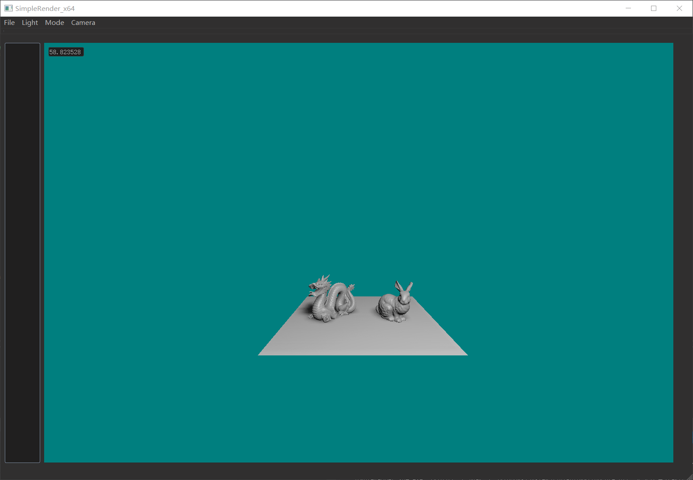
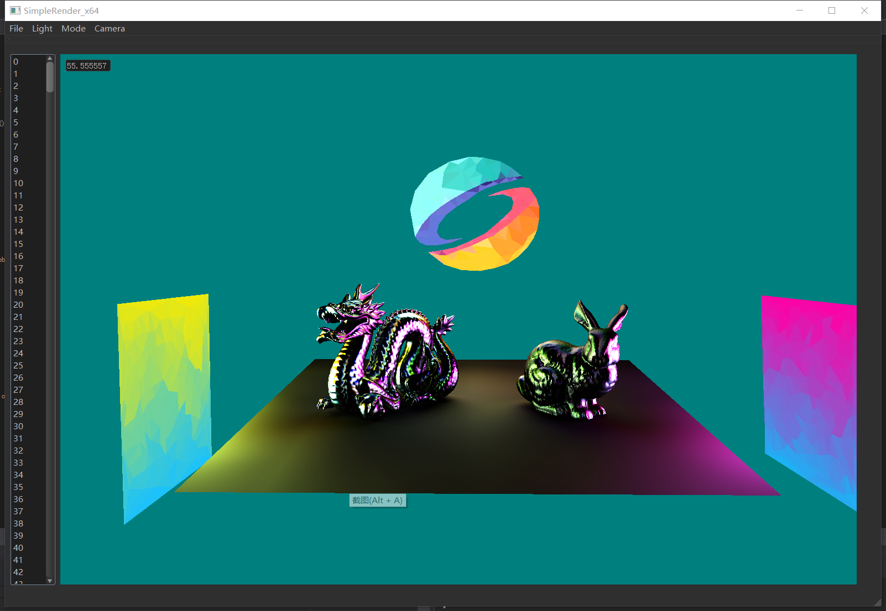

# Readme

这是一个基于QT,C++,OpenGL的简单的渲染器。以下是它的界面

目前前三个menu的按钮还需要完善（更改输入object和render模式需要在MyRender类里手动修改），第四个按钮摄像机可以调整摄像机模式。多个object一起绘制有一些难度，这里还涉及shader管理，内存管理，用户交互，有点负责，以后慢慢改了，目前把场景类写了个框架，距离真正使用还有很长距离。还有PBR也贴图也没加进去，现在只能读mtl文件的给定的参数。

目前已有的功能：

多边形PRT光照算法（siggraph2020），结果如下：

PCSS、SSAO有些参数设置问题导致绘制有点问题，图先不放了，未来会修复，目前比较忙

PCF+PBR微表面模型点光源（全方向） 见第一张图

